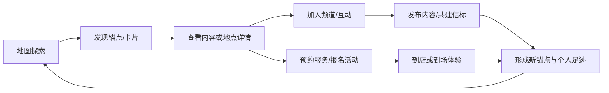

# 足迹（Footprint）项目创新点、需求与操作逻辑总说明

> 文档性质：产品定义、创新点归纳、需求基线、操作逻辑与现状差距总说明  
> 整理日期：2026-07-28  
> 适用范围：`map_q` 微信小程序 / uni-app 前端及其后续产品、后端、运营设计  
> 核心原则：保持现有“地图为主、内容悬浮、五大主导航、粉紫品牌色、卡片化表达”的 UI 与操作逻辑大方向不变。

---

## 0. 文档依据与口径

本说明综合以下信息形成：

1. 《足迹商业计划书》
2. 《足迹详细设计说明书（DDS）》
3. 《足迹项目创新点与设计要领》
4. “平台运营及产品设计相关讨论”截图
5. `map_q` 当前前端代码、`pages.json` 注册页面、组件、数据请求、Mock、本地存储与导航逻辑

本文严格区分三个层级：

- **产品目标**：材料中明确提出、未来希望完整实现的能力。
- **现有原型**：当前前端已有页面或可交互演示，但可能依赖 Mock、本地存储或提示框。
- **生产能力**：需要真实后端、账号、权限、审核、支付、消息、地图服务或算法支撑后才能对外上线。

商业计划书中的愿景与创新点可作为产品方向，但不能直接视为当前代码已经实现。DDS 后半部分存在“溯光APP”、商品 API、React/Flutter 等历史模板残留，技术落地时应以当前 `map_q` 的 **uni-app + Vue 3 + 微信小程序优先**为准。

---

## 1. 项目总定义

### 1.1 一句话定位

足迹是一套以地图空间为主界面、以地点与兴趣频道为组织结构、以内容卡片为连接媒介、以本地服务为价值闭环的空间社交平台。

### 1.2 项目不是什么

足迹不应被做成：

- 另一个传统导航软件；
- 另一个商家列表或点评平台；
- 把普通信息流简单叠到地图上的内容应用；
- 只记录 GPS 轨迹的运动工具；
- 只提供陌生人聊天的社交大厅。

### 1.3 项目核心对象

平台围绕五个对象形成关系：

```text
用户 → 在地点产生内容 → 内容形成地图锚点
  ↓                         ↓
加入频道 ← 地点/兴趣形成频道 ← 服务与活动挂载
  ↓                         ↓
沟通、共创、预约、评价、分享、再次到访
```

### 1.4 核心价值闭环



---

## 2. 项目创新点体系

## 2.1 从“时间线”转向“空间线”

### 创新定义

传统社交平台以时间排序内容，足迹以地理空间组织内容。地图不是附属工具，而是内容发现、社交连接、服务转化的第一入口。

### 用户价值

- 用户先选择“看哪里”，再决定“看什么”。
- 内容与真实地点关联，可信度、代入感和行动价值更强。
- 用户从机械刷屏转为带目标或带好奇心的空间探索。

### 产品要求

- 首页地图始终是视觉主体。
- 地图锚点必须与内容卡片一一对应。
- 地图移动、缩放、选点应影响内容流。
- 卡片选择应反向聚焦地图位置。
- 地图范围、时间范围和兴趣标签共同决定内容召回。

### 与当前代码的对应

当前首页、服务页已具备地图、锚点、卡片、分类、地图状态和内容联动基础；真实的空间推荐、热力计算与区域数据仍需后端支持。

---

## 2.2 “地图 + 卡片面板”双视图联动

### 创新定义

地图负责空间关系，卡片负责内容表达。用户不需要在“地图页”和“列表页”之间反复切换，而是在同一场景中完成发现和阅读。

### 核心交互

- 点击锚点：地图聚焦，匹配卡片高亮并进入可见区。
- 点击卡片信息区：地图聚焦，不立即离开首页。
- 点击卡片媒体区或标题：进入详情。
- 拖动内容面板：改变地图露出比例，但不改变整体设计语言。
- 内容筛选变化：地图锚点同步刷新。

### 创新价值

解决传统地图信息密度不足、传统信息流缺少空间上下文的问题。

---

## 2.3 地点、兴趣、服务三维频道

### 创新定义

频道不是普通聊天群，而是“地点、主题或服务场景”的长期内容容器。

### 频道类型

| 类型 | 层级示例 | 核心内容 |
|---|---|---|
| 地理频道 | 城市 → 商圈 → 景区/商场副本 | 在地内容、导览、活动、商家 |
| 兴趣频道 | 摄影 → 街拍/风光/器材 | 作品、讨论、招募、路线 |
| 服务频道 | 摄影服务 → 咨询/案例/预约 | 服务说明、评价、订单沟通 |
| 临时事件频道 | 展会/演出/市集 | 倒计时、报名、现场消息、归档 |
| 个人频道 | 创作者/技能服务者 | 作品集、日历、评价、预约 |

### 创新价值

- 地图解决“在哪里”，频道解决“围绕这里持续发生什么”。
- 内容不因时间流逝快速消失，而是沉淀为地点或主题资产。
- 服务咨询天然发生在有内容和信任积累的场景里。

---

## 2.4 “副本地图”机制

### 创新定义

进入商场、景区、展会、校园或临时活动区域后，系统从全局地图切换到该区域的专属地图与内容空间。

### 核心规则

1. 用户点击副本锚点，或进入地理围栏。
2. 系统展示副本简介与进入提示。
3. 用户进入副本后，地图边界锁定在该区域。
4. 锚点、内容、服务、活动、频道均切换为副本范围数据。
5. 室内场景可增加楼层切换、设施点和推荐动线。
6. 退出副本后恢复原地图中心、缩放级别与筛选条件。

### 创新价值

将游戏中的沉浸式副本概念用于真实空间，尤其适合景区、展会、商圈、校园和大型商业体。

---

## 2.5 信标共建与“地点维基”

### 创新定义

用户不只是消费地图数据，也能创建、补充、纠错和维护地点内容。

### 完整逻辑

```text
用户创建候选信标
→ 填写位置、名称、说明与证据
→ 自动内容与位置风险检测
→ 社区点赞/认证编辑审核
→ 达到可信阈值
→ 纳入公共地图
→ 持续补充、版本追溯、争议处理
→ 优质信标升级为官方推荐或导览节点
```

### 必要机制

- 编辑历史与版本回滚；
- 创建者、贡献者、认证编辑者身份记录；
- 重复点合并；
- 错误位置纠偏；
- 虚假地点、隐私地点、敏感地点审核；
- 可信度分数不能仅依赖“3 个点赞”，应结合账号质量、证据与位置一致性。

---

## 2.6 路线成为可分享、可协作的社交对象

### 创新定义

路线不仅用于导航，还可以承载故事、兴趣、服务和社交关系。

### 路线属性

- 出行方式：步行、骑行、自驾、公共交通；
- 距离、时长、难度、适用人群；
- 起点、终点、中间节点；
- 节点图文、视频、语音和服务；
- 作者与共同编辑者；
- 可见范围、授权方式；
- 收藏、点赞、评论、复用次数；
- 时间有效性与路况提示。

### 操作逻辑

1. 新建路线或导入轨迹。
2. 选择出行方式。
3. 编辑路径和节点。
4. 在节点插入内容。
5. 设置标题、标签、适用场景与隐私。
6. 邀请共创者，可选。
7. 预览路线故事。
8. 发布到地图、频道与个人足迹。
9. 其他用户收藏、复制、导航或基于原路线二次创作。

---

## 2.7 AI 行程推荐与全链路辅助

### 创新定义

AI 不只回答问题，而是把自然语言意图转成可执行的地图结果、路线和日程。

### 典型输入

- “明天下午在成都，帮我安排三小时适合拍照的路线。”
- “附近有没有安静、适合亲子的室内活动？”
- “根据我收藏的地点，排一个周末行程。”

### 推荐流程

1. 获取用户明确授权的位置、时间和偏好。
2. 识别硬约束：时间、预算、人数、交通方式、营业时间。
3. 从地点、活动、服务、路线和频道内容中召回候选项。
4. 计算时间可达性与路线顺序。
5. 生成可编辑行程。
6. 用户手动增删、排序、调整停留时长。
7. 保存到地图日历。
8. 到达前或接近地点时提醒。

### AI 能力边界

- AI 结果必须显示数据来源与更新时间。
- 营业时间、价格、门票、交通等不能仅凭模型生成。
- AI 只提供建议，最终路线和预约由用户确认。
- AI 内容审核不能取代人工申诉和高风险复核。

---

## 2.8 地图日历与时空提醒

### 创新定义

把“地点关注、活动预约、路线计划、日历安排”合并为时空计划系统。

### 操作逻辑

1. 用户在地点、活动、服务或路线页点击“加入计划/提醒我”。
2. 选择日期、时间、提前提醒时长。
3. 可设置进入指定范围时提醒。
4. 系统写入平台日历；获得授权后可同步手机系统日历。
5. 临近时间推送天气、路线、预约状态和注意事项。
6. 用户到达后可一键打卡、打开副本或开始路线。
7. 行程结束后生成回顾卡片并询问是否发布。

### 适用场景

展会、演出、市集、旅行、景区预约、商家活动、同好聚会。

---

## 2.9 基于兴趣与相似度的“搭子”匹配

### 创新定义

借鉴游戏组队中的“找搭子”模式，将用户、路线、时间和兴趣同时作为匹配条件，避免在公开大厅盲目组队。

### 匹配要素

- 兴趣标签；
- 计划地点和时间；
- 出行方式；
- 路线难度和节奏；
- 年龄范围与身份认证；
- 历史评价、失约率和举报风险；
- 隐私偏好与可见范围。

### 操作逻辑

1. 用户从路线、活动或地点发起“找搭子”。
2. 填写时间、人数、偏好与安全要求。
3. 系统展示候选用户及匹配理由，而非只给一个分数。
4. 双方确认后生成临时会话或活动频道。
5. 到期自动归档；双方可互评。

### 安全要求

- 默认模糊位置，不向陌生人展示精确住址和实时轨迹；
- 支持实名/身份验证标签，但不公开证件信息；
- 支持一键退出、拉黑、举报和紧急联系人；
- 未成年人匹配必须采用更严格限制。

---

## 2.10 内容即服务、服务即创作

### 创新定义

内容卡和服务卡使用统一的视觉结构，使用户在浏览真实体验时自然发现服务，也让服务者通过作品和案例建立信任。

### 闭环

```text
内容种草 → 查看地点/服务 → 咨询 → 预约 → 到店/履约
→ 真实评价 → 生成体验内容 → 反哺服务推荐
```

### 价值

- 个人技能可以场景化变现；
- 商家不只依赖广告和搜索排名；
- 平台可形成佣金、推广、创作者分成和 B 端定制收入。

---

## 2.11 真实评价与反操纵机制

### 创新定义

商家可以入驻并经营频道，但不能直接控制用户评价结果。

### 评价来源分层

| 评价类型 | 可信标识 | 说明 |
|---|---|---|
| 已完成订单评价 | 已履约 | 与真实预约/支付/核销关联 |
| 到店评价 | 到访验证 | 在合理时间和地理范围内产生 |
| 普通体验评价 | 未验证 | 用户主动发布，降低权重 |
| 社区补充 | 共建 | 用于地点信息，不等同消费评价 |

### 风控规则

- 识别短时集中好评/差评、设备或账号团伙、模板化文本；
- 商家只能回复、申诉和提交证据，不能删除合法差评；
- 用户恶意差评同样进入风控；
- 评价排序应兼顾可信度、相关性、时间与内容质量；
- 广告、赞助与自然评价必须明确区分。

---

## 2.12 实景探索、迷雾和彩蛋

### 创新定义

通过实景、迷雾解锁、地理彩蛋和创作者红包，让“到达某地”本身成为内容体验的一部分。

### 能力拆分

- **实景探索**：在授权和设备支持下查看附近实景内容。
- **迷雾解锁**：用户真实到达后点亮区域或内容。
- **时间胶囊**：在指定时间或指定地点后公开。
- **彩蛋区**：到达、点赞或完成任务后查看彩蛋。
- **创作者激励**：博主或主理人设置任务、红包或权益。

### 风险控制

- 红包涉及资金时必须有支付、反作弊和活动规则；
- 地理彩蛋不能诱导用户进入危险或禁止区域；
- 实景内容需处理人脸、车牌、住宅和未成年人隐私；
- 所有“到达解锁”应允许因定位漂移进行人工申诉。

---

## 3. 用户角色与权限需求

## 3.1 角色定义

| 角色 | 核心目标 | 主要权限 |
|---|---|---|
| 游客 | 低门槛了解平台 | 浏览公开地图、公开内容和公开频道 |
| 普通用户 | 探索、记录、互动 | 发布、收藏、评论、打卡、加入频道、预约 |
| 创作者/服务者 | 建立影响力和变现 | 创作者中心、服务发布、数据看板、定时发布 |
| IP/版权方 | 发布并管理授权内容 | IP 绑定、版权声明、授权规则、系列管理 |
| 商家/组织 | 经营地点和活动 | 商家频道、服务卡、活动发起、订单与回复 |
| 频道管理员 | 维护社区秩序 | 公告、成员、内容、角色和子频道管理 |
| 平台运营/审核员 | 安全和生态治理 | 审核、风控、申诉、推荐、活动配置 |

## 3.2 登录与注册

### 游客

- 可查看公开内容；
- 不可发布、私信、报名、预约或查看精确私人信息；
- 首次触发受限操作时再引导登录，不强制首屏登录。

### 普通用户

- 微信授权登录；
- 昵称头像可后补；
- 地图定位、通知、相册、相机、日历权限按场景申请。

### 商家/组织

- 完成主体、地点和经营资质认证；
- 可认领地点或申请新建商家点；
- 可发起活动、管理服务和回复评价；
- 不可改写用户评价。

### 创作者/IP 方

- 创作者可申请服务者身份；
- IP 方需提交权属材料；
- IP 授权范围、有效期、转载方式和商业用途必须结构化保存。

## 3.3 频道四级权限建议

1. **所有者**：频道配置、转让、解散、角色管理。
2. **管理员**：内容管理、成员管理、公告、子频道。
3. **认证成员/服务者**：发布特定内容、活动或服务。
4. **普通成员/访客**：浏览、发言、互动，受频道规则限制。

---

## 4. 信息架构与页面层级

## 4.1 五大一级入口

| 一级入口 | 产品职责 | 当前主页面 |
|---|---|---|
| 首页 | 地图探索、内容发现、锚点联动 | `pages/index/index` |
| 服务 | 地图服务发现、服务详情与预约 | `pages/service/index` |
| 发布 | 三类创作入口 | `pages/plus/index` |
| 消息 | 地图频道、私信、系统通知 | `pages/message/index` |
| 我的 | 个人身份、足迹、收藏、日程 | `pages/my/index` |

## 4.2 当前代码已注册的后续层级

当前 `pages.json` 共注册 47 个页面，后续层级已经覆盖：

- 通用详情：详情、搜索、媒体预览、预约；
- 地图探索：AI 搜索、锚点图层、锚点操作、地图分享、迷雾解锁；
- 发布创作：普通发布、沙盒、IP 发布、类型选择、AI 模板、轨迹编辑、话题、位置、预览、共创、成功页；
- 频道消息：地图频道、频道详情、频道线程、消息搜索、联系人资料、频道权限、通知、聊天；
- 个人中心：我的服务、足迹热力图、时间轴、设置、隐私、资料编辑；
- 服务体系：服务详情、服务卡类型。

### 层级原则

- 一级页保持地图或核心信息概览，不堆叠全部管理功能。
- 二级页处理单个对象：地点、内容、服务、活动、路线、频道。
- 三级页处理操作：预约、授权、权限、编辑、筛选、分享。
- 成功页只承接结果反馈与下一步，不再塞入编辑功能。

---

## 5. 各模块详细需求与操作逻辑

## 5.1 首页地图探索

### 需求点

- 自动定位与拒绝授权后的默认城市；
- 地图缩放、拖动、回到当前位置；
- 内容分类标签；
- 地图锚点和卡片可见区联动；
- 搜索、AI 搜索；
- 时间轴、空间范围筛选；
- 图层入口；
- 地图分享；
- 内容加载、刷新、空状态和错误重试；
- 选中锚点、聚合锚点和副本锚点状态。

### 首次进入

1. 读取上次地图中心和筛选状态。
2. 若无缓存，展示默认城市并请求定位授权。
3. 定位成功后更新中心点并请求附近内容。
4. 定位失败时保留默认城市，展示“手动选择城市”入口。
5. 首屏先显示地图骨架与最少量锚点，再加载内容卡片。

### 浏览与联动

1. 用户拖动或缩放地图。
2. 地图停止操作后，通过防抖获取新的可视边界。
3. 请求边界内内容，不在连续拖动时重复爆发请求。
4. 新数据返回后更新锚点与卡片。
5. 用户点击锚点，卡片滚动到对应位置并高亮。
6. 用户点击卡片信息区，地图聚焦该点。
7. 用户点击媒体/标题，进入对应类型详情页。

### 面板状态

- 最小态：保留搜索、分类和拖拽把手；
- 半屏态：主浏览状态，地图与内容同时可见；
- 展开态：提高内容阅读效率，但仍保留地图语境；
- 拖动过程中不触发卡片点击；
- 快速滑动结束后才刷新可见卡片对应锚点。

### 搜索

1. 点击搜索框进入搜索页。
2. 输入关键词后展示地点、内容、服务、活动、路线分组。
3. 点击地点/内容：返回首页并聚焦地图，或进入详情。
4. 点击服务：进入服务详情或预约。
5. 自然语言问题可进入 AI 搜索页。
6. 无结果时允许扩大地图范围、修改时间范围或清除标签。

---

## 5.2 内容详情

### 内容类型

普通动态、视频、文章、地点、活动、服务、轨迹。

### 通用操作

- 返回、作者信息、关注；
- 媒体预览；
- 地点与距离；
- 点赞、评论、收藏、分享；
- 进入地图定位；
- 进入关联频道；
- 举报与不感兴趣；
- 原创与版权标识。

### 类型差异

| 类型 | 专属信息 | 专属操作 |
|---|---|---|
| 普通动态 | 图文、位置、话题 | 评论、共创 |
| 视频 | 播放、进度、声音 | 全屏播放 |
| 文章 | 正文、目录、阅读量 | 展开阅读 |
| 地点 | 地址、开放信息、地点百科 | 导航、纠错 |
| 活动 | 时间、人数、倒计时 | 报名、提醒 |
| 服务 | 价格、可约时段、评价 | 咨询、预约 |
| 轨迹 | 距离、时长、节点、难度 | 导航、复制路线 |

---

## 5.3 服务模块

### 服务发现

1. 进入服务页，地图与服务卡片保持首页同构。
2. 用户按个人服务、商家服务、活动服务或细分类筛选。
3. 地图范围变化后刷新附近服务。
4. 点击服务锚点，聚焦对应卡片。
5. 点击卡片进入服务详情。

### 服务详情

必须展示：

- 服务者或商家身份；
- 服务说明、价格或计价方式；
- 地址和服务范围；
- 可预约时间；
- 作品/实景媒体；
- 可信评价；
- 取消、改期、退款规则；
- 咨询、收藏、关注、预约、导航。

### 预约流程

```text
选择服务
→ 选择日期与时段
→ 填写人数/规格/备注
→ 确认地点与联系方式
→ 展示费用、取消规则和隐私说明
→ 提交订单
→ 支付或等待服务者确认
→ 生成订单会话与日历事件
→ 到期提醒
→ 履约确认
→ 评价
```

### 商家活动

商家可在自己的地点频道发起活动，但需要：

- 活动与主体认证；
- 明确时间、人数、费用和规则；
- 报名名单和容量控制；
- 取消通知；
- 活动结束后归档；
- 用户评价不由商家修改。

---

## 5.4 发布与创作

### 发布入口

中央发布按钮保持现有交互，展开：

1. 发布动态；
2. 沙盒创作；
3. IP 内容发布；
4. 可扩展：新建信标/地图共创。

### 普通发布

```text
输入正文
→ 添加图片/视频
→ 选择内容类型
→ 添加话题
→ @用户
→ 添加位置
→ 设置可见范围
→ 原创声明
→ 预览
→ 发布
```

要求：

- 无内容不可提交；
- 图片/视频上传需有进度、失败重试和删除；
- 定位可选精确、模糊、隐藏；
- 发布中不可重复提交；
- 发布成功后生成地图锚点、频道内容和个人时间轴记录；
- 审核中的内容需显示状态。

### 沙盒创作

适合创作者试验内容，不直接进入公共流。

```text
编辑内容
→ 选择沙盒分类
→ 选择定时发布
→ 预览
→ 向指定好友测试分享
→ 保存草稿或正式发布
```

要求：

- 草稿自动保存；
- 测试分享必须清晰标识“非公开”；
- 定时发布前允许修改、取消；
- 正式发布时重新执行审核。

### IP 内容发布

```text
选择已认证 IP
→ 编辑内容与媒体
→ 添加 IP 标签和系列
→ 选择版权声明
→ 选择授权方式
→ 预览授权摘要
→ 发布
```

要求：

- 未完成权属认证不能选择“官方 IP”身份；
- 授权方式不能只是一段展示文字，应形成结构化规则；
- 转载、商用、二创、署名和期限分别配置；
- 发布后保留授权版本，规则变更不可追溯覆盖历史订单。

### 地图共创

1. 在地图长按或发布入口选择“创建信标”。
2. 选择坐标并校正。
3. 填写名称、类型、介绍和证据。
4. 检查是否与现有地点重复。
5. 提交审核。
6. 审核中显示候选状态。
7. 通过后成为公共信标；未通过可修改或申诉。

---

## 5.5 消息与频道

### 消息首页

建议保持“地图频道 / 私信 / 系统通知”三类入口，并支持：

- 未读数；
- 最近访问；
- 搜索；
- 星标频道；
- 消息免打扰；
- 草稿提示；
- 失败重发。

### 地图频道进入路径

- 从消息首页进入；
- 从地图锚点进入；
- 从地点/活动/服务详情进入；
- 从分享卡片进入；
- 到达副本范围后推荐进入。

### 频道详情

展示：

- 频道名称、说明、所属地点/兴趣；
- 所有者与管理员；
- 成员数、在线/活跃信息；
- 子频道或线程；
- 频道规则；
- 加入/退出；
- 通知设置；
- 举报与屏蔽；
- 权限角色。

### 频道线程

- 消息支持文本、图片、视频、语音、位置、卡片、投票等扩展类型；
- 长按支持回复、收藏、转发、举报；
- 地点或服务消息可反向打开地图；
- 重要消息可生成地图广播，但必须受频道权限与审核限制；
- 临时事件频道结束后进入只读归档。

### 私信

- 1 对 1 和多人会话；
- 可分享模糊位置、地点卡、路线和订单；
- 精确位置必须二次确认；
- 订单会话置顶订单状态；
- 支持拉黑、举报、撤回和已读状态。

---

## 5.6 我的

### 个人主页

- 头像、昵称、认证、简介、兴趣标签；
- 发布数、打卡数、收藏数、服务数据；
- 足迹地图；
- 内容作品；
- 服务；
- 时间轴；
- 收藏；
- 频道；
- 设置与隐私。

### 足迹地图

1. 聚合用户发布、打卡、路线、活动和收藏。
2. 按内容类型显示不同图层。
3. 支持城市、时间、类别筛选。
4. 点击区域查看该区域内容汇总。
5. 支持热力图和迷雾解锁。
6. 对外分享时默认做位置模糊和隐私检查。

### 时间轴

- 按年、月、日组织内容；
- 内容、服务、活动、频道事件使用不同图标；
- 可添加纪念点；
- 支持年度回顾；
- 删除原内容后，时间轴同步处理；
- 私密内容不会因回顾自动公开。

### 收藏

- 内容、地点、路线、服务、活动、频道分类；
- 列表与地图两种视图；
- 支持收藏夹；
- 已下架对象显示原因和可替代项；
- 收藏行为用于推荐时需在隐私政策中说明。

---

## 5.7 导航接入

### 建议策略

早期不建议自研完整导航引擎。产品应建立统一的 `NavigationProvider` 抽象：

- 微信小程序内优先使用系统地图能力；
- 支持唤起腾讯/高德/百度导航；
- 统一处理 GCJ-02 坐标；
- 路线详情与足迹故事由平台自身维护；
- 实时路况、转向导航交给成熟地图服务。

当前代码已使用腾讯地图相关配置及 `uni.openLocation`，因此后续不能在页面里直接写死某一家地图服务，应由配置层统一切换。

---

## 6. 关键状态与异常逻辑

## 6.1 地图

- 定位未授权：默认城市 + 手动选择；
- 定位失败：保留缓存位置；
- 地图无数据：展示扩大范围和切换分类；
- 网络失败：保留旧数据，允许重试；
- 锚点过密：聚合而非全部渲染；
- 坐标缺失：卡片可读，但隐藏导航操作；
- 地图移动中：不立即请求，停止后防抖刷新。

## 6.2 发布

- 草稿、上传中、审核中、已发布、审核失败、已下架；
- 上传失败允许单个资源重试；
- 页面退出前提示保存草稿；
- 重复点击发布只生成一次请求；
- 定时发布失败进入待处理列表。

## 6.3 预约与活动

- 可约、名额紧张、已满、已截止；
- 待确认、待支付、已预约、已取消、已完成、退款中；
- 时间冲突时给出提示；
- 商家取消时主动通知并提供退款或改期；
- 评价仅在满足规则后开放。

## 6.4 消息

- 发送中、已发送、已读、失败；
- 离线重连；
- 重复消息去重；
- 消息撤回和删除的差异；
- 被禁言、被移出频道、频道已归档；
- 精确位置分享过期。

---

## 7. 核心数据实体

| 实体 | 关键字段 |
|---|---|
| User | id、角色、认证、标签、隐私、信誉、状态 |
| Place | 坐标、边界、名称、类型、地址、可信度、版本 |
| Beacon | 地点、创建者、贡献者、审核状态、版本历史 |
| ContentCard | 类型、作者、媒体、位置、时间、频道、互动、审核 |
| Route | 出行方式、轨迹、节点、距离、时长、权限、版本 |
| Channel | 类型、关联地点/兴趣/服务、成员、角色、规则 |
| Service | 提供者、地点、类目、价格、可约时段、状态 |
| Activity | 主理人、地点、时间、人数、报名规则、频道 |
| Booking | 用户、服务/活动、时段、金额、状态、核销 |
| Review | 订单/到访凭证、评分、文本、风控状态、申诉 |
| Message | 会话、发送者、消息类型、关联对象、状态 |
| CalendarEvent | 来源对象、时间、提醒、地理围栏、同步状态 |
| IPAsset | 权利人、系列、权属证明、授权规则、有效期 |
| Notification | 类型、优先级、触发条件、已读、免打扰 |
| ModerationCase | 对象、风险、证据、处理、申诉、审计 |

### 数据关系原则

- 内容、服务、活动和路线都可以关联地点与频道；
- 一个地点可以存在多个频道，但必须有清晰的官方/社区标识；
- 订单评价必须关联订单或到访凭证；
- 地图坐标变更要保留历史，避免内容整体漂移；
- 权限判断由后端完成，前端隐藏按钮不能视为安全控制。

---

## 8. 非功能性需求

## 8.1 性能

- 关键操作目标响应时间不超过 2 秒；
- 地图拖动和内容滚动目标 60fps；
- 地图请求按边界、缩放级别和分类分页；
- 锚点聚合、图片懒加载、媒体压缩；
- 地图与内容请求可取消，防止旧请求覆盖新状态；
- 本地缓存必须设置版本和过期时间。

## 8.2 稳定性

- 弱网可浏览已缓存内容；
- WebSocket 指数退避重连；
- 发布、预约、支付采用幂等请求；
- 页面恢复时校验订单、发布和消息最新状态；
- 错误提示给出下一步，不只显示“失败”。

## 8.3 隐私

- 精确位置、轨迹、日历、相册和通知按场景申请；
- 默认最小化采集；
- 支持模糊位置；
- 支持删除、导出和撤回授权；
- 实时位置设置自动过期；
- 私密内容不能进入公共推荐和公共地图。

## 8.4 安全与合规

- 传输加密；
- 登录态与权限校验；
- 内容、图片、位置、版权审核；
- 支付与退款安全；
- 操作审计；
- 举报、申诉、未成年人保护；
- 遵守个人信息保护与网络内容治理要求。

## 8.5 可用性

- 首次使用用短引导解释“锚点与卡片联动”；
- 关键操作不依赖隐藏手势；
- 按钮有禁用、加载、成功和失败状态；
- 文本、颜色和点击区满足移动端可访问性；
- 保持现有 UI 方向，不在后续页面突然切换成后台管理风格。

---

## 9. 当前代码实现状态

## 9.1 已具备较完整前端表现的部分

- 五大底部导航及中央发布入口；
- 首页地图、分类、卡片流和锚点展示；
- 服务地图与服务卡片；
- 普通、视频、文章、地点、活动、服务、轨迹多类型详情；
- 普通发布、沙盒发布、IP 发布基础编辑界面；
- 搜索、媒体预览和预约确认页面；
- 地图图层、锚点操作、地图分享、迷雾解锁等后续页面原型；
- 地图频道、频道详情、线程、权限、联系人资料等页面原型；
- 足迹热力图、时间轴、隐私、设置、资料编辑等个人后续页面；
- 点赞、收藏、报名等部分本地交互；
- 定位、地图状态缓存、打开地图位置；
- 本地 API 配置、地图数据请求、消息请求和通知 WebSocket 基础代码。

## 9.2 已部分实现，但仍依赖模拟或本地状态

| 能力 | 当前状态 | 生产化缺口 |
|---|---|---|
| 地图内容 | 本地 `3000` 接口 + Mock 回退 | 正式数据、边界查询、聚合、缓存 |
| 消息列表 | API 失败后返回 Mock | 实时会话、历史、已读、文件、风控 |
| 点赞收藏 | 本地存储 | 用户账号同步、并发计数、防刷 |
| 活动报名 | 本地存储和弹窗 | 名额、订单、取消、通知、核销 |
| 发布 | 可编辑媒体并提示成功 | 上传、审核、落库、分发、失败恢复 |
| 预约 | 已有确认页和入口 | 时段库存、订单、支付、退款、日历 |
| AI 搜索/模板 | 已有页面表现 | 模型服务、检索、来源、风控 |
| 频道权限 | 已有页面原型 | 后端 ACL、角色继承、审计 |
| 足迹/热力图 | 已有视觉页 | 真实轨迹、聚合、隐私与导出 |
| IP 授权 | 已有选择与展示 | 权属认证、授权合同、版本与订单 |
| 地图分享 | 已有页面原型 | 真实图片生成、短链、权限校验 |

## 9.3 尚未形成生产闭环的重点能力

- 游客、普通用户、商家、创作者、IP 方完整账号体系；
- 商家入驻、地点认领与资质审核；
- 订单、支付、退款、核销；
- 真实评价与反刷评价；
- AI 行程规划与可编辑路线；
- 路线实时记录、多人协作和版本冲突处理；
- 地理围栏与地图日历提醒；
- 实景/AR；
- 彩蛋、红包和激励结算；
- 搭子匹配与安全机制；
- 内容审核、版权审核、举报和申诉后台；
- 推荐算法、埋点、数据看板；
- 正式的频道消息服务和离线推送。

---

## 10. 材料与代码中的不一致及处理建议

## 10.1 地图技术方案不一致

- 商业计划书提到高德、百度、Mapbox、OSM；
- 讨论截图仍在探讨自研或接入百度/高德；
- 当前代码实际含腾讯地图配置，并使用微信地图能力。

**建议**：当前继续使用腾讯/微信地图完成小程序版本，但把地图、逆地理编码、路线和外部导航封装为供应商适配层，避免后续替换时重写页面。

## 10.2 DDS 存在历史模板残留

DDS 中出现“溯光APP”、商品 API、React/Flutter、Android/iOS 等内容，与当前项目并不完全一致。

**建议**：

- 前端技术基线统一为 uni-app + Vue 3；
- 将“商品”统一修订为“服务/活动/订单”；
- 微信小程序作为当前优先端，H5 作为预览和兼容端；
- 后续另写正式 SRS/API 文档，不直接把 DDS 的示例接口当作最终合同。

## 10.3 评价管理需要独立产品设计

现有材料强调“商家接入但评价真实”，但没有形成可执行规则。

**建议**：优先补齐订单评价、到访评价、普通评价的可信分层，再设计异常检测、商家回复、申诉和平台复核。

## 10.4 页面数量增长但业务状态未统一

当前后续页面较丰富，部分操作仅 `showToast`，容易造成“页面很多但流程没有真正闭环”。

**建议**：每个页面明确：

- 入口；
- 输入参数；
- 输出结果；
- 加载/空/错/无权限状态；
- 数据来源；
- 返回后的刷新规则；
- 是演示页、可用页还是生产页。

---

## 11. 推荐实施优先级

## P0：建立可验证的核心闭环

1. 统一用户登录、游客态和定位权限。
2. 首页地图—卡片—详情完整联动。
3. 正式内容 API、上传、发布、审核状态。
4. 收藏、点赞、评论账号化。
5. 服务详情—预约—订单基础闭环。
6. 消息基础会话和系统通知。
7. 隐私、举报和内容审核基础能力。

### P0 验收闭环

```text
登录/游客进入
→ 地图发现内容
→ 查看详情
→ 收藏或评论
→ 发布带位置内容
→ 地图出现新锚点
```

以及：

```text
地图发现服务
→ 查看服务
→ 选择时间
→ 提交预约
→ 消息收到状态
→ 完成后评价
```

## P1：强化项目差异化

1. 地点频道与地图入口打通；
2. 信标共建和版本记录；
3. 路线编辑、路线卡和地图分享；
4. 足迹热力图和时间轴；
5. 地图日历与活动提醒；
6. 创作者中心和服务管理；
7. 评价可信分层。

## P2：形成智能与运营能力

1. AI 搜索；
2. AI 行程推荐；
3. AI 创作辅助；
4. 商家/组织入驻；
5. 活动频道；
6. 推荐算法与运营配置；
7. IP 授权管理。

## P3：探索性创新

1. 搭子匹配；
2. 实景/AR；
3. 地理围栏实时提醒；
4. 彩蛋、红包和任务；
5. 多人实时路线共创；
6. 第三方自定义图层和 B/G 端地图方案。

---

## 12. 产品级验收清单

### 地图与内容

- [ ] 锚点和卡片一一对应；
- [ ] 地图和卡片双向联动；
- [ ] 地图范围变化不会请求风暴；
- [ ] 定位拒绝后仍可使用；
- [ ] 无数据、弱网、接口失败有可恢复路径；
- [ ] 七类卡片进入正确详情。

### 发布

- [ ] 普通、沙盒、IP 三类入口职责清晰；
- [ ] 媒体上传支持进度和失败重试；
- [ ] 位置支持精确、模糊、隐藏；
- [ ] 草稿、审核、发布失败状态完整；
- [ ] 发布成功后地图、频道、个人页同步。

### 服务

- [ ] 服务信息与提供者身份明确；
- [ ] 可约时段与库存真实；
- [ ] 订单状态可追踪；
- [ ] 取消、改期、退款规则明确；
- [ ] 评价与真实履约关联。

### 消息与频道

- [ ] 地点、兴趣、服务频道区分明确；
- [ ] 私信和频道消息不会混淆；
- [ ] 未读、已读、失败重试准确；
- [ ] 频道权限由后端验证；
- [ ] 举报、拉黑、免打扰可用。

### 隐私与安全

- [ ] 权限按场景申请；
- [ ] 精确位置默认不公开；
- [ ] 实时位置自动过期；
- [ ] 足迹、日历、收藏可单独控制可见性；
- [ ] 内容、评价、商家和 IP 均有审核与申诉。

---

## 13. 对外表达版创新点

如果用于路演、比赛或商业计划，可将创新点浓缩为以下七项：

1. **空间线社交**：以地图替代时间线成为内容与社交入口。
2. **地图—卡片双向联动**：在空间关系与内容表达之间无缝切换。
3. **地点频道与副本地图**：让景区、商圈、展会成为可运营的数字场景。
4. **信标共建与地点维基**：由用户和主理人持续共建真实地点知识。
5. **路线社交与时空计划**：路线可记录、可共创、可分享，并与日历提醒联动。
6. **内容—服务闭环**：内容建立信任，服务完成转化，评价反哺推荐。
7. **AI 行程与场景辅助**：将自然语言需求转成可编辑、可预约、可执行的地图计划。

其中真正应作为核心壁垒长期建设的是：

- 地点、内容、频道、服务之间的数据关系；
- 地图场景中的真实内容密度；
- 信标共建与评价可信体系；
- 用户足迹、兴趣和服务履约形成的长期数据资产；
- 地图副本与本地组织的运营网络。

---

## 14. 最终产品原则

后续优化与开发均应遵循：

1. 地图始终是第一语境。
2. 页面增加层级，但不改变用户已形成的主操作路径。
3. 卡片承担统一的信息表达，类型差异通过局部能力体现。
4. 普通用户路径尽量一步直达，复杂配置下沉到二级或三级页。
5. 商业能力不能破坏内容真实性。
6. 位置创新必须以隐私和人身安全为前提。
7. 原型页面必须逐步从“点击有反馈”升级为“数据有结果、失败可恢复、状态可追踪”。
8. 优先打通核心闭环，再扩展 AI、AR、红包和多人协作等高成本能力。

