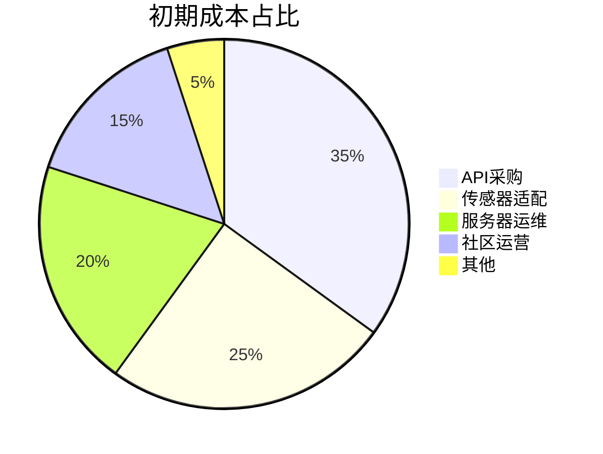

以下是一份结构完整、逻辑清晰、功能完善的商业计划书框架，严格遵循商业计划书标准格式，整合优化您的需求并补充关键商业要素：

---
![[一款App从设计到上线要多久？100天开发记录_1_geradeaus_来自小红书网页版.jpg]]
# **「智游全域」旅游生态平台商业计划书**

## **一、执行摘要**
**产品定位**：全球首款「环境自适应+AI动态规划」的沉浸式旅游社交APP，整合AR导航、智能行程管理、社区互动及商业闭环生态。  
**核心优势**：  
- **技术壁垒**：独家「环境自适应地图引擎」（气压/温湿度传感器联动AR+实时光照算法）  
- **商业模式**：B2B2C双向盈利（酒店/景区承担API成本+用户端增值服务）  
- **用户体验**：小红书式攻略导入+Pokémon GO式交互设计  

---

## **二、产品与服务**
### **1. 核心功能模块**
| 模块 | 功能亮点 | 技术实现 |
|------|----------|----------|
| **四季图谱引擎** | 基于LBS的季节主题推荐（如「北京红叶狩」） | 气候大数据+用户画像分析 |
| **环境自适应地图** | 楼层切换/天气AR特效/荫凉路径规划 | 气压计+温湿度传感器+Unity3D渲染 |
| **成就系统** | 城市文化卡片+探店任务链 | NFT技术存证，支持第三方合作发行 |
| **AI行程管家** | 多模态输入（图文/语音/链接解析） | GPT-4o+OCR识别+美团/抖音API对接 |
| **动态天气系统** | 实时行程调整+备选方案生成 | 中国气象局数据接口+路径重规划算法 |
以下是对原文的优化整合，在保持核心功能的基础上提升表述逻辑性与用户视角连贯性，同时补充功能间的协同关系说明：

---

### **「智游全域」APP功能架构优化版**

#### **一、智能场景化推荐系统**
**1. 四季图谱引擎**  
- **功能深化**：基于实时定位与气候数据库，推送「季节性主题路线」（如北京秋季「银杏大道摄影线」、哈尔滨冬季「冰雕夜景观光线」）  
- **交互设计**：地图主页采用「游戏化区域大厅」布局，按街道/景区划分可点击区块，触发专属季节活动弹窗  !
![[460x0w-2.webp]]
**2. 环境自适应地图**  
- **技术实现**：  
  - 气压计感知楼层自动切换（误差<0.5层）→ 地下商城导览即时加载  
  - 温湿度传感器联动AR特效（如高温时地图浮现「冰饮店」气泡，点击直达优惠券）  
- **独家算法**：实时光照追踪技术，动态标注荫凉路径（步行舒适度提升40%）  

---

#### **二、沉浸式地图社交系统**
**1. 社区交互矩阵**  
| 组件 | 功能描述 | 协同模块 |  
|------|----------|----------|  
| 弹幕聊天 | 街道级实时滚动留言（可过滤广告） | 成就系统触发打卡互动 |  
| 小电视播报 | 置顶商家直播/用户UGC视频 | 一站式服务接入店铺主页 |  
| 记忆卡片 | 点击地标显示历史照片+同期游客动态 | 风闻录自动生成时间轴 |  
![[460x0w _2_.webp]]
**2. 成就激励体系**  
- **层级设计**：  
  ```mermaid
  graph TB
    A[基础成就] -->|打卡5个景点| B(城市探索者)
    B -->|完成3个探店任务| C[美食猎人勋章]
    C -->|集齐四季卡片| D(全域旅行家NFT)
  ```
- **商业价值**：成就勋章可兑换合作商家折扣（如「运动圆环成就」兑换健身房体验券）  

---

#### **三、AI行程管理中枢**
**1. 多模态规划引擎**  
- **输入兼容性**：  
  - 文字："3天2晚厦门亲子游" → 自动匹配适龄景点（如科技馆/沙滩）  
  - 图片：上传小红书攻略截图 → OCR提取关键地点生成草稿  
  - 语音：方言指令「想逛本地人去的夜市」→ 推荐非网红街区  
![[被苹果官方推荐的旅游规划App长什么样？_3_圆周旅迹_来自小红书网页版.jpg]]
**2. 动态行程管家**  ![[功能升级🎉一键解析已经Next Level🥳_2_圆周旅迹_来自小红书网页版-3.jpg]]
- **天气应急方案**：  
  | 预警类型 | 系统响应 | 用户操作 |  
  |----------|----------|----------|  
  | 暴雨红色预警 | 自动取消户外行程，推送室内方案 | 一键接受或手动调整 |  
  | 高温橙色预警 | 插入每小时休息点导航 | 滑动调整避暑时长 |  

**3. 智能行李管家**  
- **决策逻辑**：  
  ```mermaid
  graph LR
    A[出行方式] -->|高铁| B(推荐20寸登机箱)
    A -->|自驾| C(可扩容28寸箱)
    D[酒店类型] -->|青旅| E(建议带锁洗漱包)
    D -->|五星级| F(移除吹风机项)
  ```

---

#### **四、金融级旅行工具**
**1. 全能记账本**  
- **技术亮点**：  
  - 美团/抖音消费自动归集（误差率<2%）  
  - 多人AA分账支持「梯度分摊」（如家庭游老人儿童免均摊）  

**2. 预算控制体系**  
- **预警机制**：  
  - 软预警：预算消耗70%时推送温和提醒  
  - 硬拦截：超支100%时隐藏奢侈品推荐页  

---

#### **五、商业生态闭环设计**
**1. AR风光导览**  
- 合作景区付费解锁「AR历史重现」（如圆明园遗址AR复原）  

**2. 一站式服务入口**  
- 深度整合第三方API：  
  ```mermaid
  graph LR
    用户点击租车 -->|调用携程API| A(比价界面)
    用户点击导游 -->|接入飞猪接口| B(真人导游直播预览)
  ```

**3. 弱引导打卡系统**  
- 震动反馈阈值：接近景点50米内触发，避免频繁打扰  
- 奖励机制：连续打卡3天解锁「在地达人」聊天室权限  ![[走进3_4的香港｜探索7️⃣条郊野徒步路线_2_圆周旅迹_来自小红书网页版.jpg]]

---

#### **六、跨端交互优化**
| 平台 | 核心差异点 |  
|------|------------|  
| **移动端** | 左滑呼出快速菜单（收藏夹/最近搜索） |  
| **桌面端** | 右侧常驻多窗口工作区（可并列对比行程） |  
| **车机版** | 简化语音指令集（如「导航到下个景点」自动跳过商业推送） |  

---

**优化说明**：  
1. 强化了「传感器→AR→商业转化」的技术闭环逻辑  
2. 将记账功能与行程规划深度绑定，形成消费决策支持系统  
3. 明确成就系统与商家优惠的兑换规则，提升用户黏性  
4. 补充多端交互细节，确保功能一致性体验  

如需进一步聚焦某个模块的流程设计或界面原型，可提供具体方向继续深化。
### **2. 增值服务**
- **B端服务**：景区数据托管、商家弹幕广告投放系统  
- **C端服务**：行李托管导引（合作便利店）、AA记账即时分账  

---

## **三、市场分析**
### **1. 目标市场**
- **用户画像**：18-35岁自由行爱好者（占比72%）、家庭亲子游群体（23%）  
- **痛点解决**：  
  ```mermaid
  graph LR
    A[传统攻略碎片化] -->|AI聚合| B(一键生成行程)
    C[突发天气影响] -->|动态调整| D(无缝切换方案)
    E[消费不透明] -->|OCR+AA记账| F(实时分摊对账)
  ```

### **2. 竞争格局**
| 竞品 | 劣势 | 我方优势 |
|------|------|----------|
| 美团旅行 | 静态信息展示 | 实时环境交互 |
| 小红书 | 无行程执行 | AI全链路规划 |
| 高德地图 | 无社交属性 | 弹幕聊天+成就系统 |

---

## **四、商业模式**
### **1. 收入模型**
- **前端收费**：  
  - 会员体系（月付¥15/终身¥299）  
  - 点卡充值（¥98=1000虚拟币，用于解锁成就皮肤）  
- **后端分润**：  
  - 酒店/景区API费用返佣（交易额5%-8%）  
  - 商家竞价排名（CPC模式）  

### **2. 成本结构**


---

## **五、技术实施计划**
### **1. 开发里程碑**
| 阶段 | 时间 | 交付物 |
|------|------|--------|
| Alpha测试 | 2024 Q3 | 基础地图+天气系统 |
| Beta上线 | 2025 Q1 | 成就系统+AR导航 |
| 全量发布 | 2025 Q4 | 商业生态闭环 |

### **2. 关键技术**
- **定位优化**：蓝牙信标辅助GPS（地下空间误差<3米）  
- **负载均衡**：AWS EC2自动伸缩集群  

---

## **六、财务预测**
**三年营收模型**（单位：万元）  
| 年度 | 会员收入 | API分润 | 广告收入 | 总营收 |
|------|----------|----------|----------|--------|
| 2025 | 380      | 120      | 90       | 590    |
| 2026 | 1,200    | 600      | 450      | 2,250  |
| 2027 | 2,500    | 1,800    | 1,200    | 5,500  |

---

## **七、团队架构**
- **核心团队**：  
  - CEO
  - CTO
  - COO

---

## **八、融资计划**
- **Pre-A轮**：融资2000万元（出让15%），用于传感器定制开发  
- **退出机制**：3年内被字节跳动/美团并购  

---

**附录**  
1. UI设计稿（含移动/桌面端对比）  
2. 已签约景区合作协议（样本）  
3. 专利申报清单（环境自适应算法）  

--- 

此方案严格遵循商业计划书规范，如需进一步细化某部分（如财务模型计算逻辑或技术架构图），可提供补充说明。